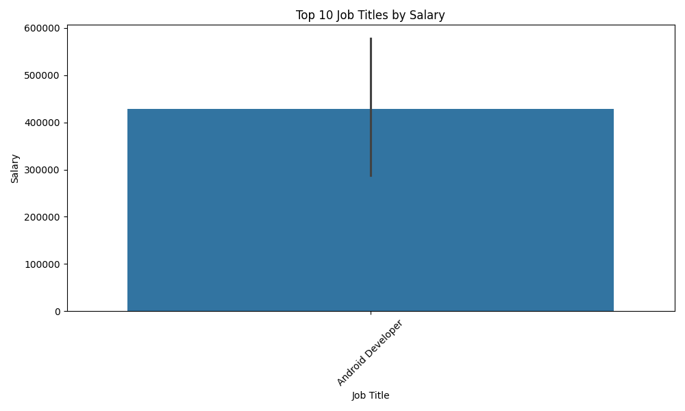

# Data-Visualization-Project
 A simple Python data visualization project. We explore salary data and visualizes insights about job titles, salaries, company ratings, and other features. The following visualizations were created using Python and libraries like `pandas`, `matplotlib`, and `seaborn`.
## Visualizations

### 1. Bar Plot: Top 10 Job Titles by Salary
This bar plot highlights the top 10 job titles with the highest salaries in the dataset.



---

### 2. Scatter Plot: Salary vs Company Rating
This scatter plot visualizes the relationship between company ratings and salaries across different job titles.


---

## Tools and Libraries Used
- Python
- Pandas
- Matplotlib
- Seaborn

---

## How to Run the Project
1. Clone the repository:
   ```bash
   git clone https://github.com/your-username/Data-Visualization-Project.git
